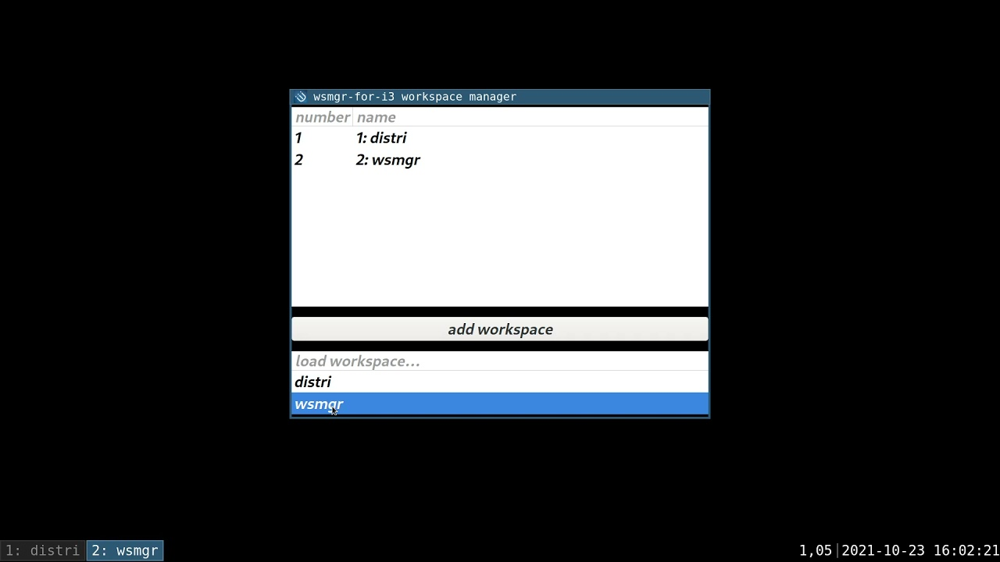
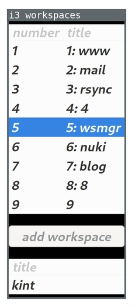

# wsmgr-for-i3

`wsmgr-for-i3` (workspace manager for i3) is a Go GTK3 program to manage i3
workspaces. It allows you to re-order and re-name workspaces easily.

You can see the workspace manager in action in this [4-minute introduction
video](https://youtu.be/K0JeGSivuJE):

[](https://youtu.be/K0JeGSivuJE)

Maintenance level: best-effort. I wrote this program to scratch a personal
itch. Improvements are welcome, but should first be discussed.

## Installation

Make sure you have Go 1.16 or newer installed.

Then, run:
```
go install github.com/stapelberg/wsmgr-for-i3/cmd/...@latest
```

## i3 configuration

I like to start `wsmgr` like so:

```
bindsym $mod+Tab exec --no-startup-id GTK_IM_MODULE=ibus SWT_GTK3=1 GDK_SCALE=2 GDK_DPI_SCALE=0.5 GDK_SYNCHRONIZE=1 PATH=$HOME/go/bin:$PATH wsmgr
```

(Please adjust the environment variables as you need. I have collected them over
the years.)

Also, to respect a workspace’s configured working directory, you need to prefix
the key bindings you want to change with `wsmgr-cwd`, like so:

```
bindsym $mod+Return exec exec ~/go/bin/wsmgr-cwd i3-sensible-terminal
```

## Navigating between workspaces

Double-click the workspace number to navigate to that workspace.

## Re-ordering workspaces

Drag & Drop a workspace to its desired position to re-order all workspaces.

## Loading workspaces

Declare a workspace by creating a directory in `~/.config/wsmgr-for-i3`:

```
mkdir -p ~/.config/wsmgr-for-i3/kint
```

`wsmgr` now offers to load this workspace:



The following sections explain the configurable behavior for loading a
workspace.

### Workspace name

The i3 workspace name will be set from the directory name:


### Working directory

If present, a `cwd` symlink:
1. will be used by `wsmgr-cwd` to start programs in the workspace’s `cwd`.
2. will be used for [executable files](#executables-programs-and-scripts).

Example: start programs in the most recent git repository:
```
ln -s ~/kint/chibios-teensy41 ~/.config/wsmgr-for-i3/kint/cwd
```

### Chrome window from bookmark folder

If present, a `chrome-rewindow` file contains the name of a chrome bookmark
folder to restore (implemented in `wsmgr-chrome-rewindow`)

Example: open all tabs from the “kint” bookmark folder:
```
echo kint > ~/.config/wsmgr-for-i3/kint/chrome-rewindow
```

### Executables (programs and scripts)

Shell scripts: any executable file (symlinks are dereferenced) will be
executed. They will all be executed in parallel, and there is no defined order.

Example: start Emacs when loading the workspace:
```
ln -s ~/configfiles/emacsclient ~/.config/wsmgr-for-i3/kint/
```
